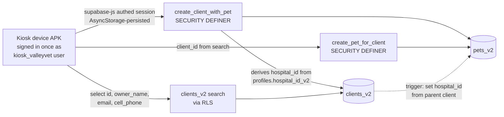

## Architecture in one picture



The kiosk authenticates once per device at setup time (hidden long-press on the home image → admin setup screen → `signInWithPassword`). The session is persisted in AsyncStorage and silently refreshed. Pet owners never see auth UX. RLS rejects anything without a session, so an unprovisioned device cannot write data.

## Critical context confirmed via Supabase MCP

- Prod `create_client(payload jsonb)` and `create_pet(payload jsonb)` are both `SECURITY DEFINER`, owner `postgres`, EXECUTE granted to `anon`/`authenticated` — this is why the current anon-client kiosk works. The v2 plan preserves this pattern but tightens EXECUTE to `authenticated` only.
- Staging already has zero functions in `public` schema; submissions from the current app point at prod and would fail against staging today.
- `internal.current_user_hospital_v2_id()` (SECURITY DEFINER) returns the calling user's `profiles.hospital_id_v2` and is the canonical source for hospital scoping.
- `pets_v2.hospital_id` is auto-populated by `internal.set_pet_hospital_from_client()` BEFORE INSERT trigger; app must not pass it.
- `pets_v2.birth_date` is `date` (not `timestamptz` like legacy).
- Test profile on staging: `mcootauc@gmail.com` → hospital_id_v2 `334c93d1-68b1-4f1e-8033-8d227f459572` (Valley Veterinary Hospital).

## Commit-by-commit plan

### Commit 1 — Environment config + Supabase client rebuild

Files: [app.config.js](app.config.js), [eas.json](eas.json), `[app/Services/SupabaseService.ts](app/Services/SupabaseService.ts)`, new `.env.example`, `[.gitignore](.gitignore)`.

- `app.config.js` branches on `const APP_VARIANT = process.env.APP_VARIANT ?? 'production'`:
    - `name`: `'OVIForm'` vs `'OVIForm (Staging)'`
    - `android.package`: `'com.mitchxcool.ValleyVetKiosk'` (keep current for prod) vs `'com.mitchxcool.ValleyVetKiosk.staging'`
    - `ios.bundleIdentifier`: `'com.mitchxcool.ValleyVetKiosk'` vs `'com.mitchxcool.ValleyVetKiosk.staging'`
    - `icon` / `adaptiveIcon`: keep current for both initially (staging icon variant is a follow-up nicety)
- `eas.json` profiles get `env` blocks:
    - `development` + `preview`: `APP_VARIANT=staging`, `EXPO_PUBLIC_SUPABASE_URL=https://acmgofotwucibmtwaeob.supabase.co`, `EXPO_PUBLIC_SUPABASE_ANON_KEY=$STAGING_SUPABASE_ANON_KEY` (EAS Secret).
    - `production`: `APP_VARIANT=production`, plus prod URL/key from EAS Secrets.
- `SupabaseService.ts` rewritten:

```ts
import 'react-native-url-polyfill/auto';
import AsyncStorage from '@react-native-async-storage/async-storage';
import { createClient } from '@supabase/supabase-js';
import type { Database } from '@/types/supabase';

const url = process.env.EXPO_PUBLIC_SUPABASE_URL!;
const key = process.env.EXPO_PUBLIC_SUPABASE_ANON_KEY!;
const variant = process.env.EXPO_PUBLIC_APP_VARIANT ?? 'production';

export const supabase = createClient<Database>(url, key, {
    auth: {
        storage: AsyncStorage,
        autoRefreshToken: true,
        persistSession: true,
        detectSessionInUrl: false,
    },
});

if (__DEV__) {
    console.log(`[supabase] variant=${variant} url=${url}`);
}
```

- Delete `[components/.env](components/.env)` (stale duplicate). Add `.env.example` documenting `EXPO_PUBLIC_SUPABASE_URL`, `EXPO_PUBLIC_SUPABASE_ANON_KEY`, `EXPO_PUBLIC_GOOGLE_PLACES_API_KEY`, `EXPO_PUBLIC_APP_VARIANT`. Add `.env` to `.gitignore` (currently only `.env*.local` is ignored — the tracked `.env` will be removed in the cleanup commit).
- New deps: `@react-native-async-storage/async-storage`, `react-native-url-polyfill`.

### Commit 2 — Regenerate Supabase TypeScript types from staging

```bash
npx supabase gen types typescript --project-id acmgofotwucibmtwaeob > types/supabase.ts
```

Place at `types/supabase.ts`. Add `"@/types/*": ["types/*"]` to `tsconfig.json` if the existing path map doesn't already cover it. Isolated commit so the large diff doesn't pollute logic commits.

### Commit 3 — UUID helper

Add `expo-crypto`. New file `[lib/uuid.ts](lib/uuid.ts)`:

```ts
import * as Crypto from 'expo-crypto';
export const uuid = (): string => Crypto.randomUUID();
```

Single import surface so a future swap is one line.

### Commit 4 — Two SECURITY DEFINER RPCs on staging

Apply via `apply_migration` against `acmgofotwucibmtwaeob`. Naming mirrors existing (`create_client_with_pet`, `create_pet_for_client`) so the diff is minimal.

```sql
create or replace function public.create_client_with_pet(p_client jsonb, p_pet jsonb)
returns jsonb
language plpgsql
security definer
set search_path = public, internal
as $$
declare
    v_hospital uuid := internal.current_user_hospital_v2_id();
    v_client_id uuid := coalesce((p_client->>'id')::uuid, gen_random_uuid());
    v_pet_id    uuid := coalesce((p_pet->>'id')::uuid,    gen_random_uuid());
begin
    if v_hospital is null then
        raise exception 'caller has no hospital_id_v2 (kiosk profile not provisioned)'
            using errcode = '28000';
    end if;

    insert into public.clients_v2 (id, hospital_id, owner_name, secondary_contact_name,
        secondary_contact_cell_phone, street, city, state, zip_code, cell_phone, email, initials)
    values (v_client_id, v_hospital,
        p_client->>'owner_name', p_client->>'secondary_contact_name',
        p_client->>'secondary_contact_cell_phone', p_client->>'street', p_client->>'city',
        p_client->>'state', p_client->>'zip_code', p_client->>'cell_phone',
        p_client->>'email', p_client->>'initials');

    insert into public.pets_v2 (id, client_id, pet_name, species, breed, birth_date,
        sex, spayed_or_neutered, color, microchip, initials)
    values (v_pet_id, v_client_id,
        p_pet->>'pet_name', p_pet->>'species', p_pet->>'breed',
        (p_pet->>'birth_date')::date, p_pet->>'sex', p_pet->>'spayed_or_neutered',
        p_pet->>'color', p_pet->>'microchip', p_pet->>'initials');
    -- pets_v2.hospital_id auto-set by pets_v2_set_hospital_id trigger

    return jsonb_build_object('client_id', v_client_id, 'pet_id', v_pet_id);
end;
$$;

revoke all on function public.create_client_with_pet(jsonb, jsonb) from public, anon;
grant execute on function public.create_client_with_pet(jsonb, jsonb) to authenticated;

create or replace function public.create_pet_for_client(p_pet jsonb)
returns jsonb
language plpgsql
security definer
set search_path = public, internal
as $$
declare
    v_hospital uuid := internal.current_user_hospital_v2_id();
    v_client_id uuid := (p_pet->>'client_id')::uuid;
    v_pet_id    uuid := coalesce((p_pet->>'id')::uuid, gen_random_uuid());
begin
    if v_hospital is null then
        raise exception 'caller has no hospital_id_v2' using errcode = '28000';
    end if;
    if not exists (select 1 from public.clients_v2 c
                   where c.id = v_client_id and c.hospital_id = v_hospital) then
        raise exception 'client_id % not found in caller hospital', v_client_id
            using errcode = '23503';
    end if;

    insert into public.pets_v2 (id, client_id, pet_name, species, breed, birth_date,
        sex, spayed_or_neutered, color, microchip, initials)
    values (v_pet_id, v_client_id,
        p_pet->>'pet_name', p_pet->>'species', p_pet->>'breed',
        (p_pet->>'birth_date')::date, p_pet->>'sex', p_pet->>'spayed_or_neutered',
        p_pet->>'color', p_pet->>'microchip', p_pet->>'initials');

    return jsonb_build_object('pet_id', v_pet_id);
end;
$$;

revoke all on function public.create_pet_for_client(jsonb) from public, anon;
grant execute on function public.create_pet_for_client(jsonb) to authenticated;
```

Staging only. Prod gets these as part of the prod cutover migration later. After applying, run `get_advisors` on staging — `SECURITY DEFINER` functions are flagged by the linter, expected, just confirm no other issues.

### Commit 5 — New Client form rewrite

Files: `[app/Services/SupabaseService.ts](app/Services/SupabaseService.ts)`, `[app/screens/NewClientForm.tsx](app/screens/NewClientForm.tsx)`.

- Replace `submitClientFormData` with:

```ts
export const submitClientFormData = async (formData: ClientFormData) => {
    const {
        data: { session },
    } = await supabase.auth.getSession();
    if (!session)
        throw new Error('Device not provisioned. Please contact staff.');

    const p_client = {
        id: uuid(),
        owner_name: formData.ownerName,
        secondary_contact_name: formData.secondaryContactName || null,
        secondary_contact_cell_phone: formData.contactCellPhone || null,
        street: formData.street,
        city: formData.city,
        state: formData.state,
        zip_code: formData.zipCode,
        cell_phone: formData.cellPhone,
        email: formData.email,
        initials: formData.initials,
    };
    const p_pet = {
        id: uuid(),
        pet_name: formData.petName,
        species: formData.selectSpecies,
        breed: formData.breed,
        birth_date: formData.birthDate, // YYYY-MM-DD
        sex: formData.sex,
        spayed_or_neutered: formData.spayedOrNeutered,
        color: formData.color,
        microchip: formData.microchip,
        initials: formData.initials,
    };

    const { data, error } = await supabase.rpc('create_client_with_pet', {
        p_client,
        p_pet,
    });
    if (error) throw error;
    return 'Successfully submitted client information! Thank you!';
};
```

- In `NewClientForm.tsx` `handleSubmit`, change `birthDate: birthDate?.toISOString()` to `birthDate: birthDate ? birthDate.toISOString().slice(0,10) : null`. Drop `hospital_id` from `formData`. Drop the `microchip: microchipStatus` field — current code overwrites `microchip` with the status string. New shape should send `microchip: microchipStatus === 'Yes' ? microchip : microchipStatus` (matches NewPetForm's existing behavior) to keep parity for the website feed.

### Commit 6 — New Pet form rewrite (with client search)

Files: `[app/Services/SupabaseService.ts](app/Services/SupabaseService.ts)`, `[app/screens/NewPetForm.tsx](app/screens/NewPetForm.tsx)`, new `[components/formComponents/ClientSearchField.tsx](components/formComponents/ClientSearchField.tsx)`.

- Add `searchClients` to `SupabaseService.ts`:

```ts
export type ClientSearchResult = {
    id: string;
    owner_name: string;
    email: string | null;
    cell_phone: string | null;
};

export const searchClients = async (
    q: string
): Promise<ClientSearchResult[]> => {
    const trimmed = q.trim();
    if (trimmed.length < 2) return [];
    const pattern = `%${trimmed}%`;
    const { data, error } = await supabase
        .from('clients_v2')
        .select('id, owner_name, email, cell_phone')
        .or(
            `owner_name.ilike.${pattern},email.ilike.${pattern},cell_phone.ilike.${pattern}`
        )
        .order('owner_name')
        .limit(10);
    if (error) throw error;
    return data ?? [];
};
```

RLS automatically scopes results to the kiosk user's hospital. 2-char minimum matches existing breed search.

- New `ClientSearchField` component: text input + debounced (300ms) search → `FlatList` of result cards showing `owner_name`, `email`, `cell_phone`. Selecting a row sets `selectedClient` state, hides the list, shows a "selected client" pill with a small "Change" button to re-open the search. Empty state shows "Type 2+ characters to search". Loading shows a spinner.

- Replace the `OwnerDetailsCard` on `NewPetForm.tsx` page 0 with `ClientSearchField` (drop firstName/lastName/cellPhone/email state and validation — those are no longer collected). Pet input cards remain unchanged. Submit is blocked until `selectedClient` is set; add a `clientError` state for that case.

- New `submitPetFormData`:

```ts
export const submitPetFormData = async (formData: PetFormData) => {
    const {
        data: { session },
    } = await supabase.auth.getSession();
    if (!session)
        throw new Error('Device not provisioned. Please contact staff.');
    if (!formData.clientId) throw new Error('No client selected.');

    const p_pet = {
        id: uuid(),
        client_id: formData.clientId,
        pet_name: formData.petName,
        species: formData.selectSpecies,
        breed: formData.breed,
        birth_date: formData.birthDate,
        sex: formData.sex,
        spayed_or_neutered: formData.spayedOrNeutered,
        color: formData.color,
        microchip: formData.microchip,
        initials: formData.initials,
    };
    const { data, error } = await supabase.rpc('create_pet_for_client', {
        p_pet,
    });
    if (error) throw error;
    return 'Successfully submitted pet information! Thank you!';
};
```

- Add EN/ZH translation keys for the search field: `searchClient`, `searchClientPrompt`, `noClientsFound`, `clientNotSelected`, `changeClient`.

### Commit 7 — Hidden admin setup screen + auth guard

Files: `[app/_layout.tsx](app/_layout.tsx)`, `[app/index.tsx](app/index.tsx)`, new `[app/screens/AdminSetup.tsx](app/screens/AdminSetup.tsx)`, `[contexts/AuthContext.tsx](contexts/AuthContext.tsx)` (new), `[app/Services/SupabaseService.ts](app/Services/SupabaseService.ts)`.

- New `AuthContext`: on mount, calls `supabase.auth.getSession()`, subscribes to `supabase.auth.onAuthStateChange`. Exposes `session`, `isReady`, `signIn(email, password)`, `signOut()`. Wrapped around the app in `_layout.tsx` inside `LanguageProvider`.
- New route `screens/AdminSetup` (not listed on the home page). Single-screen form: email, password, "Sign In" button. On success → `router.replace('/')` and Alert "Device provisioned successfully". On failure → inline error. Includes a "Currently signed in as: \<email\> · Sign Out" panel visible only when a session exists, for debugging during cutover (this is fine because it's behind a hidden gesture — pet owners can't reach it).
- Hidden gesture: 3-second long-press on the home image in `app/index.tsx` navigates to `/screens/AdminSetup`. Wrap the `<Image>` in `<TouchableWithoutFeedback onLongPress={...} delayLongPress={3000}>`.
- Form submit handlers in both forms already throw a clear error from the Service layer if `session` is missing (added in Commits 5 and 6) — this commit just verifies the alert path renders correctly in the existing `Alert.alert(t('submitError'), ...)` block. No additional UI changes needed in the forms themselves.

### Commit 8 — Cleanup

- Delete `[components/.env](components/.env)` (stale duplicate, prod values exposed).
- Remove the tracked `[.env](.env)` from git history-going-forward (`git rm --cached .env`) now that `.gitignore` covers it. Rotate the prod anon key as a follow-up if you care — not strictly required since anon keys are designed to be public, but the file lives next to a private Google Places key which is more sensitive.
- Remove the `// TODO: change to the hospital id...` comments from `SupabaseService.ts` (resolved by SECURITY DEFINER derivation).
- Strip remaining references to legacy `create_client` / `create_pet` / `clients` / `pets` from the codebase. Grep should find nothing in `app/` or `components/`.
- `npm run lint` and `npm test` clean.
- Update `[CLAUDE.md](CLAUDE.md)` with the new RPC names, the env switching mechanism, and the "device must be provisioned via long-press setup" runbook step.

## Testing loop (run after Commits 5, 6, and 7)

1. `eas build --profile development --platform android --local` produces a staging APK (variant icon shows "OVIForm (Staging)").
2. Install on the test Android device. Open. Long-press the home image 3s → AdminSetup → sign in as `mcootauc@gmail.com` with the staging password.
3. Verify Logcat shows `[supabase] variant=staging url=https://acmgofotwucibmtwaeob.supabase.co`.
4. Submit a New Client form. Confirm Alert success.
5. Open the website preview URL. Confirm a card with the just-submitted owner + pet appears.
6. Submit a New Pet form. Search for the same owner, select, fill pet info, submit.
7. Refresh the website preview. Confirm a second card for the same owner.
8. In Supabase Studio (staging): inspect `clients_v2` and `pets_v2` — confirm `hospital_id = 334c93d1-68b1-4f1e-8033-8d227f459572` on both, FK linkage is correct, `birth_date` is a clean date.
9. Inspect prod (`uqdolredkukdkoolnubw`) `clients` and `pets` tables — confirm row counts unchanged. Any change here means env config has a leak; stop and fix.

## Rollback

- All app changes live on a feature branch — `git revert` or branch reset.
- Staging RPCs can be `drop function public.create_client_with_pet(jsonb, jsonb)` and `drop function public.create_pet_for_client(jsonb)`.
- The kiosk APK currently on the Play Store / internal track remains the production until prod cutover.

## Prod cutover (separate, AFTER this plan is verified on staging)

Out of scope for this RN refactor. For completeness: apply the same RPC migration to prod, provision a prod kiosk user + profile, build a prod APK with `eas build --profile production --platform android`, sideload to the live kiosk, sign in once via the hidden setup gesture, verify, then archive the legacy `create_client` / `create_pet` RPCs and eventually drop the legacy tables.
